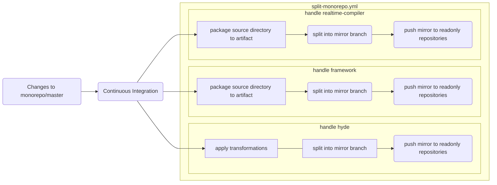

# Monorepo CI/Manual Splitting Overview

```mermaid
flowchart LR
    p(Changes to monorepo/master) --> ci(Continuous Integration)
   
    ci --> phd
    ci --> pfr
    ci --> prc
   
    subgraph sm[split-monorepo.yml]
        subgraph hhd[handle hyde]
             phd[apply transformations] --- shd[split into mirror branch] --> dhd(push mirror to readonly repositories)
        end 
        subgraph hfr[handle framework]
            pfr[package source directory to artifact] --> sfr(split into mirror branch) --> dfr(push mirror to readonly repositories)
        end
        subgraph hrc[handle realtime-compiler]
            prc[package source directory to artifact] --> src(split into mirror branch) --> drc(push mirror to readonly repositories)
        end
    end
```